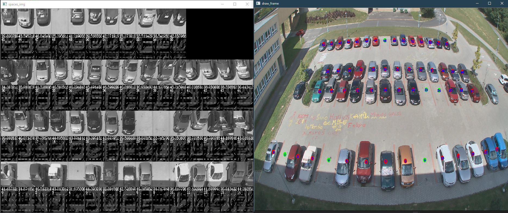

# ANO2

Image Analysis II. Detection of parking lot availablity using multiple methods.

## Getting Started

1. Download this repository
2. Unzip [opencv.zip] into solution folder
3. Open [solution](DIP.sln)  
4. Build & Run

### Prerequisites

Software:
* [OpenCV](https://opencv.org/) *included* - Image manipulation library

IDE:
* [Visual Studio 2019](https://visualstudio.microsoft.com/cs/vs/)

### Solution

Only one project. C++

## Description

Program will show final detected image and parking lots processed images for each image in [**test_images** folder](DIP/test_images).
After all images are evaluated, it will print statistics to console.

### Methods

Methods can be enabled/disabled using **define** statements in code.
Only one method can be used at once.

### Without learning

|Method|Accuracy|F1 Score|Weaknesses|Info|
|------|--------|--------|----------|----|
|Canny edge detection|99.2%|98.7%|Shadows, Far objects, Wide cars from near lots||
|Treshold, Local binnary patterns|98.7%|97.9%|Noise from ground|Wrong usage|
|LBP, HOG, Comparison Day/Night|80.4%|70.7%|Slow, Needs learning|Loads free lots images|

### Partial learning

|Method|Accuracy|F1 Score|Learning time|Weaknesses|Info|
|------|--------|--------|-------------|----------|----|
|LBP, HOG, Comparison Day/Night|80.4%|70.7%|Short|Slow|Loads free lots images|

### With learning

|Method|Accuracy|F1 Score|Learning time|Weaknesses|Info|
|------|--------|--------|-------------|----------|----|
|LBP, HOG, SVM|70.5%|27.4%|Short|Weak predictions||
|CNN XS|68.3%|-|Long|Unusable, Doesn`t work|From lecture, DLib|
|CNN XL|-|-|Infinite|Untrainable|DLib|                       
|Combination|99.3%|98.9%|Slow, Combination of above|Loads free lots images|

## Author

* [**MGSE97**](https://github.com/MGSE97)

## License

This project is licensed under the MIT License - see the [LICENSE.txt](LICENSE.txt) file for details.

This project uses OpenCV library, see the [License](OpenCV-License.txt) file for details.